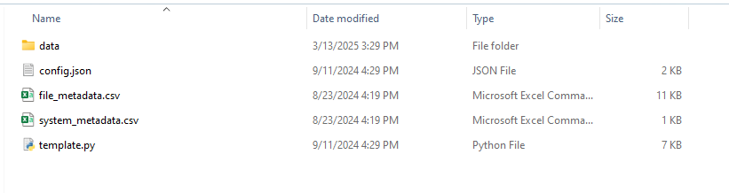
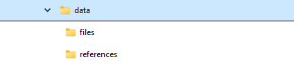
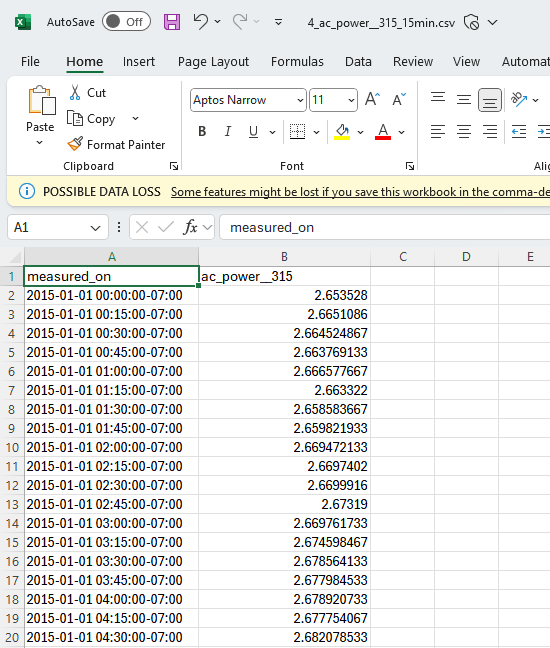
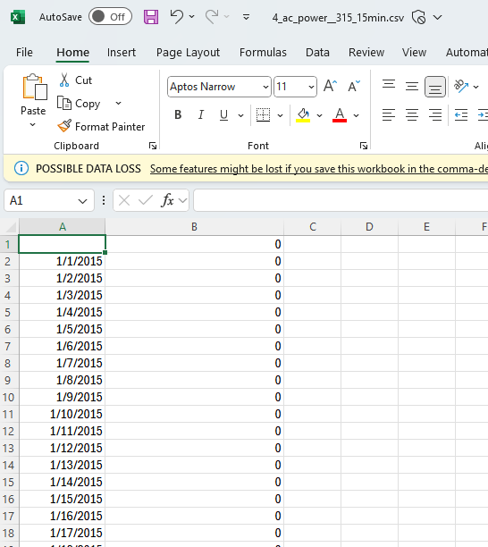

# EC2 Directory

## Objective

The EC2 directory aims to be the central point for admins to update and upload new submission tasks through the `insert_analysis.py` script for development or production. This EC2 folder should ideally be hosted on an AWS EC2 instance in the public subnet of the VPC and would be only accessed via IAM privileges. Although, if the correct AWS access keys exist on the host system you are able to update the production analysis tasks regardless.

## Contents

- `insert_analysis.py` that allows admins with AWS access keys to update or upload analysis tasks to the PV Validation Hub S3 and API for either development or production.
- `routes.json` is the file which determines the location of the files required for a proper analysis task insertion. This will need to be updated to point to the new files for a new analysis task.

## Required

- Environment variables
  - `admin_username` admin user needs to exist in API
  - `admin_password`
- `~/.aws` folder containing the AWS access required for S3 

## Insert Analysis

A new analysis task for insertion into the PV Validation Hub needs to contain certain files to be successful.

### Analysis File Requirements

- `config.json` - contains all metadata regarding the analysis task
- `file_metadata.csv` - contains the metadata for each data file for the analysis
- `system_metadata.csv` - contains the metadata for each system associated with the data files
- `template.py` - marimo template for the private results page for each submission
- Data files - folder containing all csv files the analysis
- Reference files - folder containing all results for each data file

Below are screenshots of an example folder structure containing all of the files/subfolders for an analysis insertion.





### config.json

Example JSON:

```json
{
  "category_name": "Time Shift Detection",
  "s3_bucket_folder_name": "time-shift-detection",
  "function_name": "detect_time_shifts",
  "comparison_type": "time_series",
  "display_metrics": {
    "mean_mean_absolute_error_time_series": "Mean Mean Absolute Error",
    "median_mean_absolute_error_time_series": "Median Mean Absolute Error"
  },
  "performance_metrics": [
    "runtime",
    "mean_absolute_error"
  ],
  "metrics_operations": {
    "mean_absolute_error_time_series": [
      "mean",
      "median"
    ],
    "runtime": [
      "mean"
    ]
  },
  "allowable_kwargs": [
    "latitude",
    "longitude",
    "data_sampling_frequency"
  ],
  "references_compare": [
    "time_series"
  ],
  "public_results_table": "time-shift-public-metrics.json",
  "private_results_table": "time-shift-private-metrics.json",
  "private_results_columns": [
    "system_id",
    "file_name",
    "runtime",
    "data_requirements",
    "mean_absolute_error_time_series",
    "data_sampling_frequency",
    "issue"
  ]
}
```

#### Properties

- "category_name" - name of analysis which will be used on frontend
- "s3_bucket_folder_name" - name of the folder for the analysis in the S3 bucket
- "function_name" - name of function required within submission file
- "comparison_type" - type of comparison
- "display_metrics" - mapping of final metric name to the display name for the leaderboard
  - The formatting is as follows `<metric_operation>_<performance_metric>_<references_type>`
  - e.g. `median_mean_absolute_error_time_series`
- "performance_metrics" - list of metrics to calculate for analysis task
- "metrics_operations" - contains a mapping of aggregate metric to the operation list to be performed on each metric
  - The formatting is as follows `<performance_metric>_<references_type>`
  - e.g. `mean_absolute_error_time_series`
- "allowable_kwargs" - kwargs for the submission function that are allowed
- "references_compare" - results from submission function
- "public_results_table" - name of json result file that contains information about submission results
- "private_results_columns" - name of columns that will be in final dataframe that is passed to marimo template
  - will need to contain final metric name to be used in marimo template
  - The formatting is as follows `<metric_operation>_<performance_metric>_<references_type>`

### system_metadata.csv

Required columns:

```csv
system_id,name,latitude,longitude
```

**name** is the primary key and must be unique to pass validation
**system_id** must be unique within the file to pass validation

Optional columns:

```csv
azimuth,tilt,elevation,tracking,dc_capacity
```

Ideally we want to include as many optional columns as we can, although for some data sets this may not be possible as the data is unavailable.

### file_metadata.csv

Required columns:

```csv
system_id,file_name,include_on_leaderboard
```

**file_name** is the primary key and must be unique to pass validation
**system_id** must match a local `system_id` within the `system_metadata.csv` file. All `system_id` are mapped to a new internal increment identifier within the database upon a valid insertion.

Optional columns:

```csv
timezone,data_sampling_frequency,issue,data_type
```

Optional columns may vary based on the type of problem being solved, and is subject to change as needed.

### ./data/files/ folder

This folder contains all of the individual files that we are going to feed into the runner to assess the associated algorithm. File names in this folder link directly to the file_name column in the `file_metadata.csv` file. Columns in these files can vary based on the type of inputs being assessed. A screenshot of an example file for the time shift problem is shown below.



### ./data/references/ folder

This folder contains all of the files that contains the reference data, to be assessed against the runner outputs. Files in this folder have the same naming conventions as the files in the ./data/files/ folder, so these files can be successfully linked to their input data file counterparts. Data in these files will vary based on what target variable is being assessed. A screenshot of an example output file for the time shift problem is shown below.



### template.py (Marimo template with cli args input)

Marimo python file will need to input data from `mo.cli_args()` method

Example:

```python
def create_df_from_cli_args():
        args = mo.cli_args().to_dict()
        data = args.get("results_df")
        rows = []
        for row in data:
            rows.append(json.loads(row))

        df = pd.DataFrame.from_records(rows)
        return df
```

### Insert the Analysis

In the EC2 containers shell, you are able to manage tasks by using the manage.sh bash script with optional flags

```bash
bash manage.sh {insert} <analysis-task-name> [--dry-run] [--force] [--prod] [--limit <number>] [--use-cloud-files]
```

**-–dry-run** - Test that all the files are present and validation has passed without inserting the analysis

**-–force** - Forcefully create an analysis even if the exact same analysis is already present

**-–limit** - Useful during development to only include the top N files for an analysis to shorten time for testing

**-–prod** - If a valid AWS key exists to the production AWS, you can push an analysis to production instead of your local development environment

**--use-cloud-files** - If you have a valid AWS key then you can use files that exist within a private AWS S3 bucket for sensitive data

#### REQUIRED: YOU WILL NEED TO REBUILD THE FRONTEND IMAGE AFTER INSERTING A NEW ANALYSIS FOR CHANGES TO SHOW ON FRONT END IF `--watch` IS NOT IS NOT ENABLED FOR LOCAL DEVELOPMENT

### Regarding Frontend Images and Markdown

To update analytic task images and markdown on the frontend you will need to do so within the frontend client repository. Using the analysis ID that is within the URL or within the admin dashboard in the analysis section.

Within the pv-validation-hub-client you will need to create a new folder using the ID for the task in the `public/static/assets/{ID}` folder. You can use the `development` folder and the markdown and images as a reference. Once the files are updated you may need to redeploy the frontend docker container for the changes to show.
