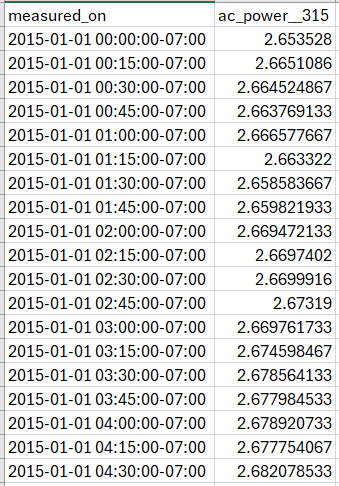
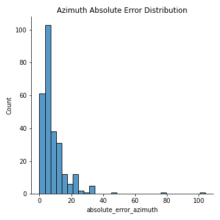
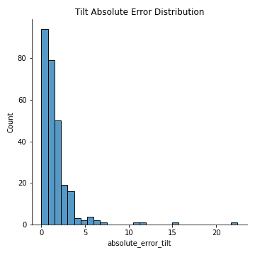
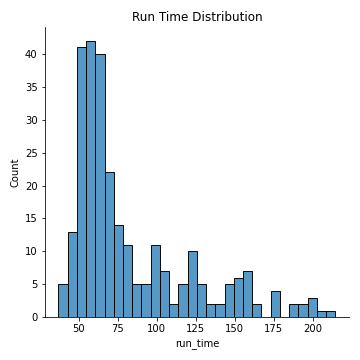
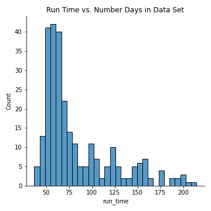

# Submission Instructions

### Validation Data Structure

Each system can have multiple inverter-level AC power data streams that can be analyzed, with each data stream validated independently of all other data streams in the system. 
Each data stream is a Pandas series, with a timezone-aware Pandas datetime index, and an AC power time series in kW. 

An example time series is shown in Figure 1. An example dataset is provided for reference here.



*Figure 1: Snapshot of the structure of the time series data analyzed for azimuth-tilt estimation.*

Download an example data set here.

### File Submission Requirements

The PV Validation Hub only accepts .zip file submissions. Each zip file must containing the following files:
1) **submission_wrapper.py**: This Python file contains the master function for running the routines. Please refer to **Submitted Function Structure** below for more information on the associated function structure.
2) **requirements.txt**: This text file contains the associated python packages (and versions, if applicable) to pip-install in order to run the submission_wrapper.py file.
3) If applicable, any additional .py files containing support functions for **submission_wrapper.py**

### Submitted Function Structure

In the **submission_wrapper.py** file, a standard function name must be used when validating a submitted algorithm. The standard function definition, which is required to run the validation, is as follows:

```
def estimate_az_tilt(time_series, latitude=None, longitude=None, data_sampling_frequency=None):
    """
    This is the required function definition for running azimuth-tilt estimation.

    Parameters
    ----------
    time_series: Required argument. Pandas series with a tz-aware datetime index.
        This is the AC power time series that is being tested for azimuth and tilt.
    latitude: Optional argument. Float.
        The associated latitude coordinate of the PV site that the AC power stream is associated with.
    longitude: Optional argument. Float.
        The associated longitude coordinate of the PV site that the AC power stream is associated with.
    data_sampling_frequency: Optional argument. Float.
        The data frequency of the time series being evaluated. 

    Returns
    -------
    azimuth: Float.
        Predicted azimuth value.
    tilt: Float.
        Predicted tilt value.

    """
    [YOUR ALGORITHM HERE]
    return azimuth, tilt
```

### Analysis Results

An automated results report containing the following metrics is returned following successful analysis:

1) Mean average error (MAE) across all of the test cases, for both azimuth and tilt values. To calculate MAE, the ground-truth azimuth/tilt value is compared to its associated estimated value, and error is returned in degrees.
3) Associated graphics, including error distributions for azimuth, tilt, and run time. Additionally, a scatter plot comparing algorithm run time vs. number of days in the AC power data set is provided. Example graphics are shown in Figures 3-6, respectively.



*Figure 3: Error distribution for system azimuth.*



*Figure 4: Error distribution for system tilt.*



*Figure 5: Distribution of algorithm run times on individual time series data streams, in seconds.*



*Figure 6: Algorithm run time vs. number of days present in the AC power data tested.*


