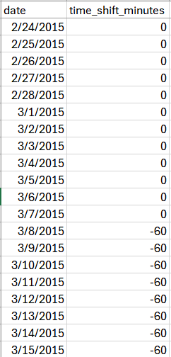
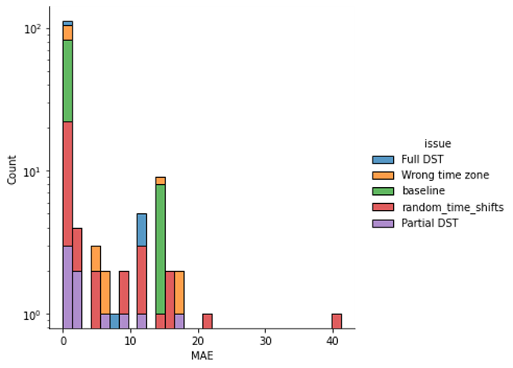
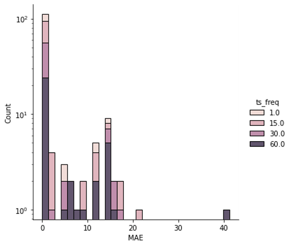
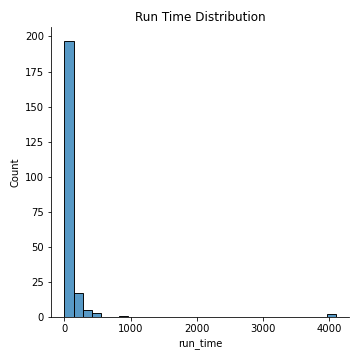

# Submission Instructions

### Validation Data Structure

For each AC power stream analyzed, there are two sets of data:
1) The associated time series data for the AC power, in kW, and an index for timezone-aware datetime.
2) The time shift validation file, which gives the associated time shift amount on a daily basis. A daily timezone-unaware timestamp is used as the associated index. 

An example time series and its associated time shift data are shown in Figures 1 and 2, respectively. An example dataset is provided for reference here.


*Figure 1: Snapshot of the structure of the time series data analyzed for time shifts.*



*Figure 2: Snapshot of the structure of the ground truth/validation data that time shift results are compared against.*

Download an example data set here.

### File Submission Requirements

The PV Validation Hub only accepts .zip file submissions. Each zip file must containing the following files:
1) **submission_wrapper.py**: This Python file contains the master function for running the routines. Please refer to **Submitted Function Structure** below for more information on the associated function structure.
2) **requirements.txt**: This text file contains the associated python packages (and versions, if applicable) to pip-install in order to run the submission_wrapper.py file.
3) If applicable, any additional .py files containing support functions for **submission_wrapper.py**

### Submitted Function Structure

In the **submission_wrapper.py** file, a standard function name must be used when validating a submitted algorithm. The standard function definition, which is required to run the validation, is as follows:

```
def detect_time_shifts(time_series,
                       latitude=None, longitude=None,
                       data_sampling_frequency=None):
    """
    This is the required function definition for running time shift validation.
    
    Parameters 
    ----------
    time_series: Required argument. Pandas series with a tz-aware datetime index.
        This is the AC power time series that is being tested for time shifts.
    latitude: Optional argument. Float.
        The associated latitude coordinate of the PV site that the AC power stream is associated with.
    longitude: Optional argument. Float.
        The associated longitude coordinate of the PV site that the AC power stream is associated with.
    data_sampling_frequency: Optional argument. Float.
        The data frequency of the time series being evaluated. 
    
    Returns
    -------
    time_shift_series: A pandas series with a tz-unaware date index of daily time shift amounts in minutes.
    See validation data above as reference.
    """
    [YOUR ALGORITHM HERE]
    return time_shift_series
```

### Analysis Results

An automated results report containing the following metrics is returned following successful analysis:

1) Mean average error (MAE) across all of the test cases. MAE is calculated at the time stamp level. The predicted time shift at each time stamp is compared to the ground-truth time shift, and error across all time shifts is calculated.
2) Average run time per instance (in this case, by data stream), calculated in seconds
3) Associated graphics, including error distributions color-coded by issue type (DST, partial DST, random shifts) and frequency of the time series evaluated (1 minute, 5 minute, 15 minute, etc.), and a distribution of instance run times. Some example graphic outputs are shown in Figures 3, 4, and 5.



*Figure 3: Error distribution of algorithm results, color-coded by issue type.*



*Figure 4: Error distribution of algorithm results, color-coded by time frequency of the input time series.*



*Figure 5: Distribution of algorithm run times on individual time series data streams, in seconds.*
