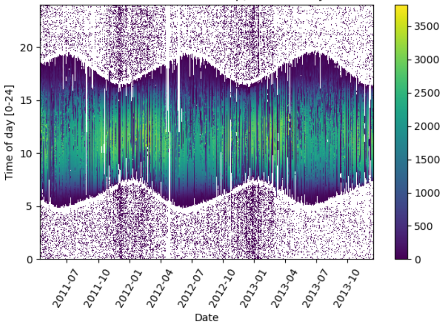
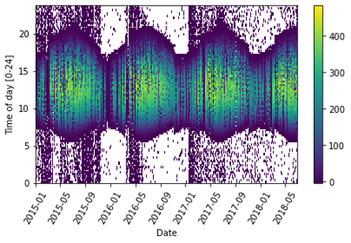
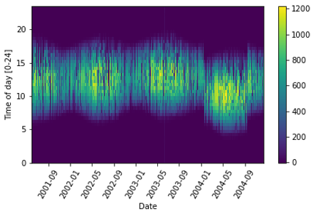

# Description
Measured photovolataic (PV) data from fielded systems may be incorrectly labeled by time zone, erroneously
contain daylight savings time (DST), or have time shift issues due to operator error. Correcting time shifts in PV data is essential for accurate solar performance analysis, including degradation analysis. To illustrate this associated issue, Figures 1, 2, and 3, respectively, show AC power data streams heatmapped by hour of the day for the following scenarios: 
1) No issues
2) DST is present
3) A random time shift is present

*Heatmapped AC power stream with no time shift issues.*

*Heatmapped AC power stream with daylight savings time.*

*Heatmapped AC power stream with a random time shift.*

Ideally, we want to run analysis on an AC power data stream like Figure 1, where no random time shifts or DST is present.

This analysis benchmarks algorithm performance for finding time shifts in PV data and correcting them accordingly. To do this, real-world PV data sets are manipulated to create common time shift issues, such as incorrect time zone, partial DST, full DST, and random time shifts. All ground truth time shift issues for each data set are recorded, and used here to validate submitted time shift detection algorithms. In particular, the associated time shift amount at each value in the predicted time series will be compared to the associated ground-truth time shift value. 

